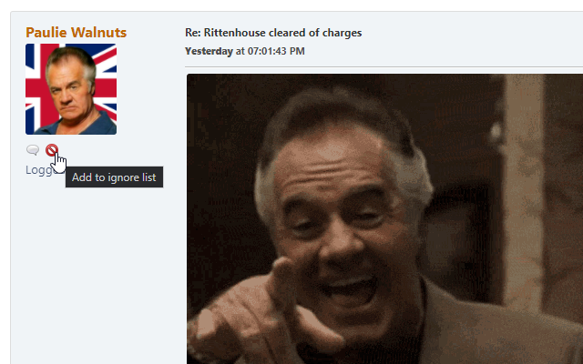
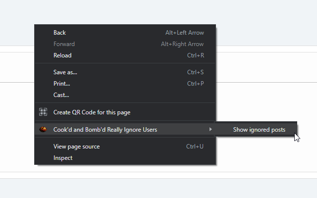
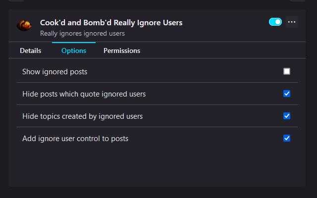

# Cook'd and Bomb'd Really Ignore Users

Really ignores ignored users on cookdandbombd.co.uk

* [Install Firefox Add-on](https://addons.mozilla.org/en-US/firefox/addon/cab-really-ignore-users/)
* [Install Chrome Extension](https://chrome.google.com/webstore/detail/bnmminpkjkhedhadjfblifhbaoemgadi/)
* [Install as a user script](https://greasyfork.org/en/scripts/426666-cook-d-and-bomb-d-really-ignore-users) (requires a [user script manager](https://greasyfork.org/en#home-step-1))

Improves the forum's built-in ignore functionality and implements user ignoring for guests.

The following will now be hidden in topics (and when posting replies):

- "You are ignoring this user" placeholders for posts by ignored users
- Posts which quote an ignored user

Topics created by ignored users will also be hidden.

## After installing

Visit your [Ignore List](https://www.cookdandbombd.co.uk/forums/index.php?action=profile;area=lists;sa=ignore) and the extension will synchronise itself with your ignored users.

If you're not logged-in, the extension will manage an independent ignore list for you via the new ignore controls it adds to every post.

## Easier ignoring

A new "Add to ignore list" control will be added to a user's profile next to their posts:

Clicking it will ignore the user - if you're logged-in, this will take you to your Ignore List and the extension will handle automatically adding the user to it.

## Viewing hidden posts and unignoring

To temporarily view hidden posts, open your browser's right-click/context menu and click "Show ignored posts" (this will be a top-level item in Firefox and under a "Cook'd and Bomb'd Really Ignore Users" menu item in Chrome).

| Firefox | Chrome |
|:-------:|:------:|
|  |  |

Ignored posts will be displayed with a fetching salmon highlight, with a new "Remove from ignore list" control added to ignored users:

Clicking it will unignore the user - if you're logged-in, this will take you to your Ignore List and the extension will handle automatically removing the user from it.

## Options

Some of the behaviour described above can be configured in the extension's options:

| Firefox | Chrome |
|:-------:|:------:|
|  |  |